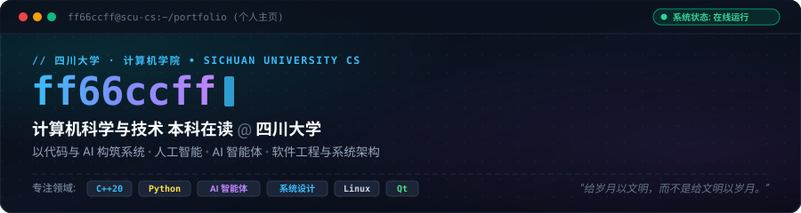
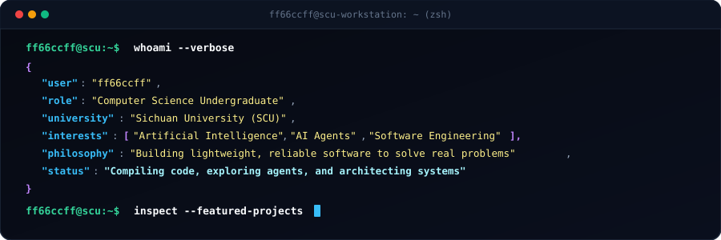
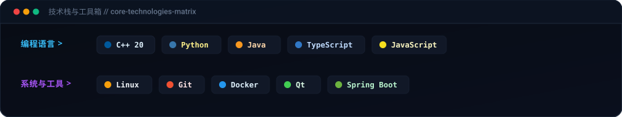
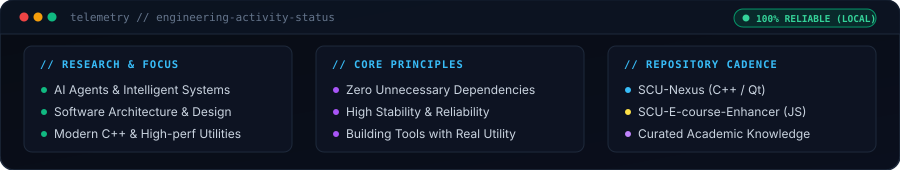

<div align="center">
  
</div>

<br/>

<div align="center">
  
</div>

---

### 👨‍💻 About Me

```bash
$ whoami
ff66ccff

Computer Science Student
Sichuan University

Focus:
> AI Agent
> Software Engineering
> System Design
```

- 🎓 **Education**: Undergraduate majoring in **Computer Science and Technology** at **Sichuan University (SCU)**.
- 💡 **Interests**: Artificial Intelligence, AI Agents, Software Architecture, and System Design.
- 🛠️ **Philosophy**: Building lightweight, reliable tools that solve real-world everyday problems (*“给岁月以文明，而不是给文明以岁月。”*).
- 🌐 **Blog**: [ff66ccff.github.io](https://ff66ccff.github.io/)

---

### 🛠️ Tech Stack

<div align="center">
  
</div>

<br/>

| Category | Technologies |
| :--- | :--- |
| **Languages** | `C++` &nbsp;•&nbsp; `Python` &nbsp;•&nbsp; `Java` &nbsp;•&nbsp; `TypeScript` &nbsp;•&nbsp; `JavaScript` |
| **Systems & Tools** | `Linux` &nbsp;•&nbsp; `Git` &nbsp;•&nbsp; `Docker` &nbsp;•&nbsp; `Qt` &nbsp;•&nbsp; `Spring Boot` |

---

### 🚀 Featured Projects

Selected software projects and campus utilities built with native performance and practical utility in mind:

| Project | Stack | Description |
| :--- | :---: | :--- |
| 🏫 [**SCU-Nexus**](https://github.com/ff66ccff/SCU-Nexus) | `C++` / `Qt` | 面向川大学生的综合校园服务软件，整合教务系统及校园服务入口，对课表、成绩、通知及高频需求进行统一管理与本地化交互。 |
| ⚡ [**SCU-E-course-Enhancer**](https://github.com/ff66ccff/SCU-E-course-Enhancer) | `JavaScript` | 四川大学网络教学平台体验增强扩展，优化课程资源浏览、课件检索与在线学习交互体验。 |
| 🎲 [**GenRN**](https://github.com/ff66ccff/GenRN) | `HTML` / `JS` | 基于 Material Design 规范构建的轻量级在线随机数生成工具，纯前端无冗余依赖，即开即用。 |
| 📚 [**SCU-CS-Class-Materials**](https://github.com/ff66ccff/SCU-CS-Class-Materials) | `Resources` | 四川大学计算机学院本科核心课程资料整理与学习经验沉淀，服务于学院同学的开源知识库。 |

---

### 📊 System Telemetry & Activity

<div align="center">
  
</div>

---

<div align="center">
  <sub>Designed with precision, simplicity, and reliability · Thanks for visiting!</sub>
</div>
